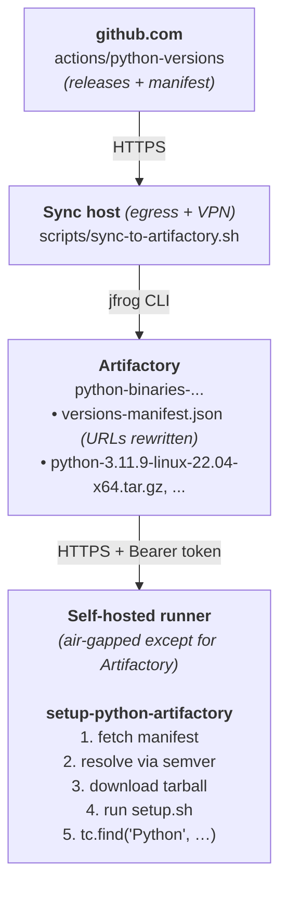

# setup-python-artifactory

Air-gapped drop-in replacement for [`actions/setup-python`](https://github.com/actions/setup-python) that resolves and downloads Python from a JFrog Artifactory mirror instead of from GitHub Releases.

It uses the same manifest schema as [`actions/python-versions`](https://github.com/actions/python-versions), runs the upstream `setup.sh` / `setup.ps1` from the tarball, and registers the install in the runner tool cache (`RUNNER_TOOL_CACHE`), so subsequent steps (`pip`, `tox`, etc.) work unchanged.

## Quick start

1. Set up Artifactory and run the sync job. See [docs/artifactory-setup.md](docs/artifactory-setup.md).
2. Publish this action to an internal repo on your GitHub Enterprise Server. See [docs/publishing.md](docs/publishing.md).
3. Use it from a workflow:

```yaml
- name: Set up Python
  uses: your-org/setup-python-artifactory@v1
  with:
    python-version: '3.11'
    artifactory-url: https://artifactory.example.com/artifactory
    artifactory-repo: python-binaries-generic-local
    artifactory-token: ${{ secrets.ARTIFACTORY_TOKEN }}

- run: python --version
```

## Inputs

| Name                  | Required    | Default                  | Description                                                                                                                                                                          |
|-----------------------|-------------|--------------------------|--------------------------------------------------------------------------------------------------------------------------------------------------------------------------------------|
| `python-version`      | conditional | _none_                   | Version range or exact version (`3.11`, `3.11.x`, `>=3.10 <3.13`, `3.11.9`). One of `python-version` / `python-version-file` is required.                                            |
| `python-version-file` | no          | _none_                   | Path to a file containing the version (`.python-version`, `pyproject.toml`'s `requires-python`, `Pipfile`'s `python_version`). Falls back to auto-detection if neither input is set. |
| `architecture`        | no          | runner arch              | `x64`, `x86`, or `arm64`.                                                                                                                                                            |
| `check-latest`        | no          | `false`                  | Re-resolve against the manifest even if a satisfying version is in the tool cache.                                                                                                   |
| `allow-prereleases`   | no          | `false`                  | Match prereleases when no GA version satisfies the range.                                                                                                                            |
| `update-environment`  | no          | `true`                   | Update `PATH`, `pythonLocation`, `Python_ROOT_DIR`, `PKG_CONFIG_PATH`.                                                                                                               |
| `artifactory-url`     | yes         | _none_                   | Base URL, e.g. `https://artifactory.example.com/artifactory`.                                                                                                                        |
| `artifactory-repo`    | yes         | _none_                   | Generic repo name holding the manifest + tarballs.                                                                                                                                   |
| `artifactory-token`   | yes         | _none_                   | Bearer token (Artifactory access token / identity token). Pass via a secret.                                                                                                         |
| `manifest-path`       | no          | `versions-manifest.json` | Path within the repo to the manifest.                                                                                                                                                |

## Outputs

| Name             | Description                                                           |
|------------------|-----------------------------------------------------------------------|
| `python-version` | Installed Python version (e.g. `3.11.9`).                             |
| `python-path`    | Absolute path to the `python` executable.                             |
| `cache-hit`      | `true` if the requested version was already in the runner tool cache. |

## Differences from upstream `actions/setup-python`

This action is intentionally smaller than upstream:

- **CPython only.** No PyPy or GraalPy.
- **No pip caching.** Use `actions/cache` directly against your Artifactory PyPI repo.
- **No problem matchers.** Add them at the workflow level if needed.
- **No freethreaded builds** are mirrored by default. Toggle `INCLUDE_FREETHREADED=true` on the sync job to publish them; the action skips them in matching.

If you need any of the above, the architecture supports adding them. Open an issue.

## How it works



## Required GHES action mirrors

Air-gapped GHES runners can't resolve `uses: <owner>/<repo>@<tag>` against `github.com`. Every third-party action referenced by this project's workflows (and by the example workflows in [docs/](docs/)) must be mirrored into your internal GHES under the same owner/repo path and tag, with the action's compiled `dist/` intact, so the existing `uses:` lines keep resolving locally.

| Action                     | Pinned at | Purpose                                                                                                     | Upstream                                   |
|----------------------------|-----------|-------------------------------------------------------------------------------------------------------------|--------------------------------------------|
| `actions/checkout@v6`      | `v6`      | Checkout source in CI lint, sync, and publish workflows                                                     | <https://github.com/actions/checkout>      |
| `actions/setup-node@v6`    | `v6`      | Install Node.js for `npm ci` / `npm run build` and lint                                                     | <https://github.com/actions/setup-node>    |
| `jfrog/setup-jfrog-cli@v5` | `v5`      | Provision `jf` CLI on the sync runner (only if you run `scripts/sync-to-artifactory.sh` as a GHES workflow) | <https://github.com/jfrog/setup-jfrog-cli> |

These tags are all on the Node.js 24 line, matching the `node24` runtime declared in this repo's `action.yml`. Older `@v4` tags use Node.js 20, which GitHub forces to Node.js 24 starting June 2nd, 2026 and removes from the runner on September 16th, 2026 ([deprecation notice](https://github.blog/changelog/2025-09-19-deprecation-of-node-20-on-github-actions-runners/)). GHES self-hosted runners need to be on `actions/runner` v2.327.1 or later for Node.js 24 compatibility.

Where this list comes from:

- `.github/workflows/lint.yml` references `actions/checkout` and `actions/setup-node`.
- `docs/artifactory-setup.md` (sync-from-Actions example) references `actions/checkout` and `jfrog/setup-jfrog-cli`.
- `docs/publishing.md` (rebuild-and-tag example) references `actions/checkout` and `actions/setup-node`.

This action itself bundles its Node deps via `ncc` into `dist/index.js`, so consumers calling `uses: your-org/setup-python-artifactory@v1` pick up no transitive action dependencies beyond the three above.

### Mirroring approach

The simplest path is a one-shot script per action: clone from `github.com/<owner>/<repo>` at the pinned tag, push to `https://<ghes>/<owner>/<repo>` preserving the tag, and rerun whenever you bump a major. Keep `dist/` from upstream, since these are JavaScript actions and the runner executes `dist/index.js` directly.

If your GHES org name doesn't match upstream (e.g. you mirror under `internal-tools/` rather than `actions/`), update the `uses:` lines in this repo's workflows and the docs examples to match. Don't rewrite them upstream, because public github.com CI for this repo relies on the original paths.

## Development

```bash
npm ci
npm run build      # produces dist/index.js (committed)
```

`dist/index.js` is required at runtime. GitHub Actions doesn't `npm install` for you, so always commit the rebuilt `dist/` alongside source changes.

### Linting

```bash
npm run lint           # everything: typecheck, eslint, prettier --check, actionlint, shellcheck
npm run format         # auto-fix prettier formatting
npm run lint:ts        # eslint only
npm run lint:actions   # actionlint only (workflow YAML)
npm run lint:shell     # shellcheck only
```

`lint:actions` and `lint:shell` auto-download the `actionlint` and `shellcheck` binaries into `./bin/` (gitignored) on first run. The source is selected automatically:

| Where you're running                                               | Source                                        |
|--------------------------------------------------------------------|-----------------------------------------------|
| Public github.com Actions (`GITHUB_SERVER_URL=https://github.com`) | upstream GitHub releases without auth         |
| GHES Actions or local dev with `ARTIFACTORY_URL` set               | Artifactory mirror under `<repo>/lint-tools/` |
| Local dev with no Artifactory configured                           | upstream GitHub releases                      |

For the Artifactory path, set:

```bash
export ARTIFACTORY_URL=https://artifactory.example.com/artifactory
export ARTIFACTORY_REPO=python-binaries-generic-local
export ARTIFACTORY_TOKEN=<read-token>
```

Pin specific releases with `ACTIONLINT_VERSION=1.7.7` (no leading `v`) or `SHELLCHECK_VERSION=v0.10.0`. When using the mirror, both must already be present under `<repo>/lint-tools/`; see [docs/artifactory-setup.md](docs/artifactory-setup.md#7-lint-tool-mirror) for how to populate them with `scripts/sync-lint-tools-to-artifactory.sh`.

CI for this repo on github.com uses the upstream path (no Artifactory secrets needed). The same workflow (`.github/workflows/lint.yml`) also passes `ARTIFACTORY_URL`/`ARTIFACTORY_REPO`/`ARTIFACTORY_TOKEN` from Variables/Secrets through to the lint steps, so a fork that runs lint on a GHES self-hosted runner will automatically use the mirror once those values are configured. Project-specific actionlint config (allowed self-hosted runner labels, known config vars) lives in `.github/actionlint.yaml`.
