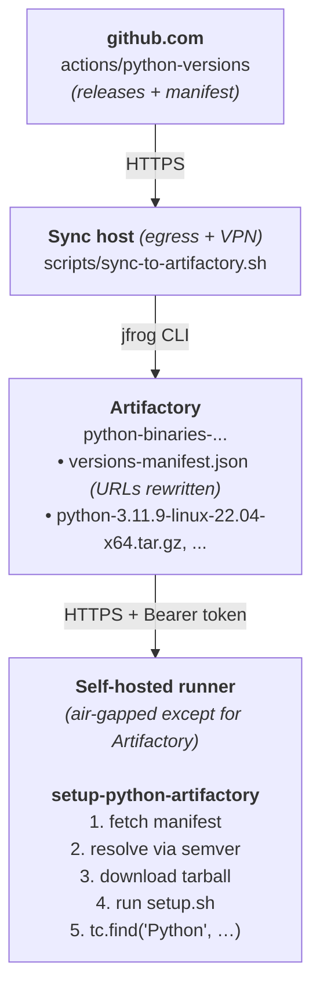

# setup-python-artifactory

[](LICENSE)

Drop-in replacement for [`actions/setup-python`](https://github.com/actions/setup-python) that resolves and downloads Python from a JFrog Artifactory mirror instead of from GitHub Releases. Designed for air-gapped GitHub Enterprise Server runners, but works anywhere `actions/setup-python` does. Uses the same manifest schema as [`actions/python-versions`](https://github.com/actions/python-versions), runs the upstream `setup.sh` / `setup.ps1` from the tarball, and registers the install in the runner tool cache so `pip`, `tox`, and other follow-on steps work unchanged.

## Usage

```yaml
- uses: actions/checkout@v6
- uses: your-org/setup-python-artifactory@v1
  with:
    python-version: '3.11'
    artifactory-url: ${{ vars.ARTIFACTORY_URL }}
    artifactory-repo: ${{ vars.ARTIFACTORY_REPO }}
    artifactory-token: ${{ secrets.ARTIFACTORY_TOKEN }}
- run: python --version
```

### Matrix

```yaml
jobs:
  test:
    strategy:
      matrix:
        python-version: ['3.10', '3.11', '3.12']
    runs-on: ubuntu-latest
    steps:
      - uses: actions/checkout@v6
      - uses: your-org/setup-python-artifactory@v1
        with:
          python-version: ${{ matrix.python-version }}
          artifactory-url: ${{ vars.ARTIFACTORY_URL }}
          artifactory-repo: ${{ vars.ARTIFACTORY_REPO }}
          artifactory-token: ${{ secrets.ARTIFACTORY_TOKEN }}
      - run: python --version
```

### Reading the version from a file

```yaml
- uses: your-org/setup-python-artifactory@v1
  with:
    python-version-file: .python-version
    artifactory-url: ${{ vars.ARTIFACTORY_URL }}
    artifactory-repo: ${{ vars.ARTIFACTORY_REPO }}
    artifactory-token: ${{ secrets.ARTIFACTORY_TOKEN }}
```

`python-version-file` accepts `.python-version`, `pyproject.toml` (reads `requires-python`), and `Pipfile` (reads `python_version`).

## Inputs

| Name                  | Required    | Default                  | Description                                                                                                                                                                          |
|-----------------------|-------------|--------------------------|--------------------------------------------------------------------------------------------------------------------------------------------------------------------------------------|
| `python-version`      | conditional | _none_                   | Version range or exact version (`3.11`, `3.11.x`, `>=3.10 <3.13`, `3.11.9`). One of `python-version` / `python-version-file` is required.                                            |
| `python-version-file` | no          | _none_                   | Path to a file containing the version (`.python-version`, `pyproject.toml`'s `requires-python`, `Pipfile`'s `python_version`). Falls back to auto-detection if neither input is set. |
| `architecture`        | no          | runner arch              | `x64`, `x86`, or `arm64`.                                                                                                                                                            |
| `check-latest`        | no          | `false`                  | Re-resolve against the manifest even if a satisfying version is in the tool cache.                                                                                                   |
| `allow-prereleases`   | no          | `false`                  | Match prereleases when no GA version satisfies the range.                                                                                                                            |
| `update-environment`  | no          | `true`                   | Update `PATH`, `pythonLocation`, `Python_ROOT_DIR`, `PKG_CONFIG_PATH`.                                                                                                               |
| `artifactory-url`     | yes         | _none_                   | Base URL, e.g. `https://artifactory.example.com/artifactory`.                                                                                                                        |
| `artifactory-repo`    | yes         | _none_                   | Generic repo name holding the manifest + tarballs.                                                                                                                                   |
| `artifactory-token`   | yes         | _none_                   | Bearer token (Artifactory access token / identity token). Pass via a secret.                                                                                                         |
| `manifest-path`       | no          | `versions-manifest.json` | Path within the repo to the manifest.                                                                                                                                                |

## Outputs

| Name             | Description                                                           |
|------------------|-----------------------------------------------------------------------|
| `python-version` | Installed Python version (e.g. `3.11.9`).                             |
| `python-path`    | Absolute path to the `python` executable.                             |
| `cache-hit`      | `true` if the requested version was already in the runner tool cache. |

## Differences from upstream `actions/setup-python`

This action is intentionally smaller than upstream:

- **CPython only.** No PyPy or GraalPy.
- **No pip caching.** Use `actions/cache` directly against your Artifactory PyPI repo.
- **No problem matchers.** Add them at the workflow level if needed.
- **No freethreaded builds** are mirrored by default. Toggle `INCLUDE_FREETHREADED=true` on the sync job to publish them. The action skips them in matching.

If you need any of the above, the architecture supports adding them. Open an issue.

## How it works



## Setup

The action requires an Artifactory instance populated with the Python tarballs and a `versions-manifest.json`. For first-time setup:

- [docs/artifactory-setup.md](docs/artifactory-setup.md): Set up the Artifactory repo and run the initial sync from `actions/python-versions`.
- [docs/publishing.md](docs/publishing.md): Publish this action to your internal GHES, including the list of third-party actions that must also be mirrored.

## Contributing

See [CONTRIBUTING.md](CONTRIBUTING.md) for the development workflow, build steps, and linting.

For security issues, follow [SECURITY.md](SECURITY.md). Please do not file public issues for security problems.

## License

[MIT](LICENSE)
