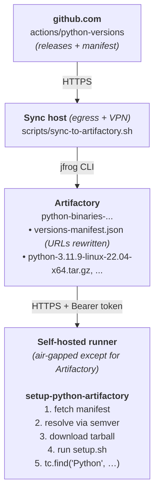

# setup-python-artifactory

Air-gapped drop-in replacement for [`actions/setup-python`](https://github.com/actions/setup-python) that resolves and downloads Python from a JFrog Artifactory mirror instead of from GitHub Releases.

It uses the same manifest schema as [`actions/python-versions`](https://github.com/actions/python-versions), runs the upstream `setup.sh` / `setup.ps1` from the tarball, and registers the install in the runner tool cache (`RUNNER_TOOL_CACHE`) — so subsequent steps (`pip`, `tox`, etc.) work unchanged.

## Quick start

1. Set up Artifactory and run the sync job. See [docs/artifactory-setup.md](docs/artifactory-setup.md).
2. Publish this action to an internal repo on your GitHub Enterprise Server. See [docs/publishing.md](docs/publishing.md).
3. Use it from a workflow:

```yaml
- name: Set up Python
  uses: your-org/setup-python-artifactory@v1
  with:
    python-version: '3.11'
    artifactory-url: https://artifactory.example.com/artifactory
    artifactory-repo: python-binaries-generic-local
    artifactory-token: ${{ secrets.ARTIFACTORY_TOKEN }}

- run: python --version
```

## Inputs

| Name | Required | Default | Description |
| --- | --- | --- | --- |
| `python-version` | conditional | — | Version range or exact version (`3.11`, `3.11.x`, `>=3.10 <3.13`, `3.11.9`). One of `python-version` / `python-version-file` is required. |
| `python-version-file` | no | — | Path to a file containing the version (`.python-version`, `pyproject.toml`'s `requires-python`, `Pipfile`'s `python_version`). Falls back to auto-detection if neither input is set. |
| `architecture` | no | runner arch | `x64`, `x86`, or `arm64`. |
| `check-latest` | no | `false` | Re-resolve against the manifest even if a satisfying version is in the tool cache. |
| `allow-prereleases` | no | `false` | Match prereleases when no GA version satisfies the range. |
| `update-environment` | no | `true` | Update `PATH`, `pythonLocation`, `Python_ROOT_DIR`, `PKG_CONFIG_PATH`. |
| `artifactory-url` | yes | — | Base URL, e.g. `https://artifactory.example.com/artifactory`. |
| `artifactory-repo` | yes | — | Generic repo name holding the manifest + tarballs. |
| `artifactory-token` | yes | — | Bearer token (Artifactory access token / identity token). Pass via a secret. |
| `manifest-path` | no | `versions-manifest.json` | Path within the repo to the manifest. |

## Outputs

| Name | Description |
| --- | --- |
| `python-version` | Installed Python version (e.g. `3.11.9`). |
| `python-path` | Absolute path to the `python` executable. |
| `cache-hit` | `true` if the requested version was already in the runner tool cache. |

## Differences from upstream `actions/setup-python`

This action is intentionally smaller than upstream:

- **CPython only.** No PyPy or GraalPy.
- **No pip caching.** Use `actions/cache` directly against your Artifactory PyPI repo.
- **No problem matchers.** Add them at the workflow level if needed.
- **No freethreaded builds** are mirrored by default. Toggle `INCLUDE_FREETHREADED=true` on the sync job to publish them; the action skips them in matching.

If you need any of the above, the architecture supports adding them — open an issue.

## How it works



## Development

```bash
npm ci
npm run build      # produces dist/index.js (committed)
```

`dist/index.js` is required at runtime — GitHub Actions doesn't `npm install` for you. Always commit the rebuilt `dist/` alongside source changes.
